# Hướng dẫn cài đặt và sử dụng các chương trình trong dự án IoT
  

Tổng quan về dự án Mạng và các giao thức IoT: Xây dựng mô hình nhà thông minh; quản lý, điều khiển từ xa thiết bị thông qua 2 giao thức là MQTT và HTTP; điều khiển Local khi không có kết nối Internet.  

# I. Cài đặt và sử dụng phầm mềm
## 1. Platform IO lập trình ESP32
**Ứng dụng trong dự án:** Lập trình vi điều khiển ESP32 cho End Devices và Gateway.

[Link hướng dẫn chi tiết](https://khuenguyencreator.com/huong-dan-cai-dat-platform-io-lap-trinh-esp32/)
## Cài đặt Visual Studio Code (VS Code)
Truy cập link: https://code.visualstudio.com/
-- Download và Cài đặt như một software bình thường.
## Cài đặt Platform IO
-- Trước khi cài Extension này, cần cài đặt Python cho máy tính đã.

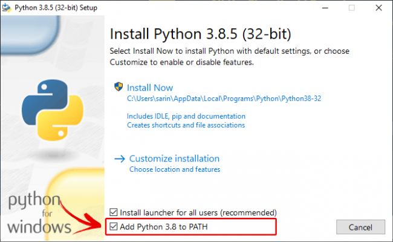


Truy cập link: https://www.python.org/downloads/.  
**Lưu ý**: Hãy tích chọn Add Python 3.8 to PATH để có thể run Python ở bất cứ đâu.  
-- Sau đó mở VS code, chuyển đến tab Extension, trong ô tìm kiếm gõ    **Platformio IDE**.
-- Nhấn cài đặt, sau khi cài đặt xong sẽ hiển thị như hình:

  
-- Restart lại VS code sau đó chờ cho tất cả các extension được load.
**Lưu ý:** máy tính cần phải có mạng nhé.
## Cài đặt Driver nạp cho mạch.
-- Tùy vào trường hợp mạch sử dụng IC UART nào, sẽ cài đặt driver cho chip đó:
Thường là 2 loại:  
CP210x: [Link download và cài đặt](https://sparks.gogo.co.nz/ch340.html).  
CH340:  [Link download và cài đặt](https://sparks.gogo.co.nz/ch340.html).  
## Hướng dẫn sử dụng Platform IO lập trình ESP32
-- Tạo một dự án lập trình ESP32 với Platform IO. Nhấn vào biểu tượng logo của Platform io, trong tab Quick Acccess nhấn Open. Vs code sẽ mở ra trang PIO Home.  
-- Sau đó nhấn vào New Project để tạo 1 dự án mới. Đặt tên dự án, Chọn KIT sử dụng, ở đây là board DOIT ESP32 DEV KIT (loại thường gặp nhất đó).  
Chọn Framwork là Arduino:

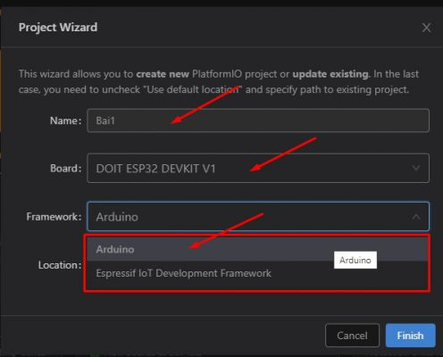

-- Bỏ tick Use Defaul Location, sau đó trỏ tới nơi lưu project, nhấn Finish để hoàn thành.  

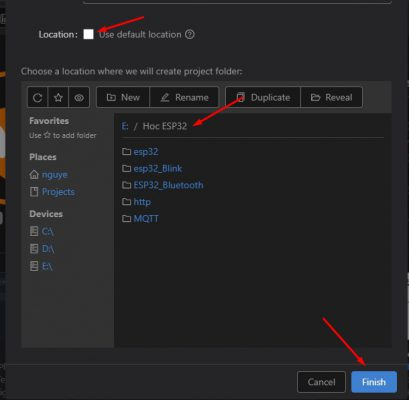  

-- Sau khi project được tạo, giao diện như sau:  


**Gồm :**
- **Phần cây thư mục dự án:** cho phép thêm, sửa, xóa các file nhanh  
- **Phần Text editor:** là nơi viết code  
- **Cửa sổ Terminal:** Nơi gõ các câu lênh  
- **Thanh công cụ:** Lần lượt là Home, Build, Upload code, Clean, Serial Monitor(màn hình serial), Terminal  
- **Thư mục Src:** Chứa Source code của chương trình, đây là nơi lưu trữ code và sẽ code trên đó. File thực thi chính là: main.cpp  
- **Ứng dụng trong dự án:** Lập trình vi điều khiển ESP32 cho End Devices và Gateway

-- Trên thực tế, có thể Copy trực tiếp các đoạn code viết bằng Arduino IDE và Paste thẳng vào đây. Chỉ cần giữ **#include <Arduino.h>** là code cũng có thể chạy bình thường. Thế nên các dự án viết bằng Arduino cũng đều có thể viết bằng VS code nhé.   
-- File platformio.ini là file cấu hình PlatformIO cho project. Nó hiển thị các thông tin như platform, board và framework được sử dụng. Cũng có thể thêm các cấu hình khác như các thư viện được đưa vào, tùy chọn upload code, hay tốc độ truyền của Serial Monitor, đường dẫn thư viện và các cấu hình khác. Thực tế nên để nguyên.  
-- Nếu muốn thay đổi tốc độ baud của Serial Monitor có thể sử dụng lệnh: **monitor_speed = 115200**.  
-- Nếu muốn thêm đường dẫn của thư viện, dùng: lib_deps = E:/thuvien. Trong đó E:/thuvien là đường dẫn tới file thư viện cần cài đặt.    
## Cài đặt thư viện cho Platformio   
### Sử dụng công cụ Libraly trong Platformio  
- Làm theo quy trình dưới đây nếu cần cài đặt thư viện trong PlatformIO IDE.  
- Nhấp vào biểu tượng Home để chuyển đến Trang chủ PlatformIO. Nhấp vào biểu tượng Libraries trên thanh bên trái.  
- Tìm kiếm thư viện muốn cài đặt.  
- Ví dụ Adafruit_BME280 .  

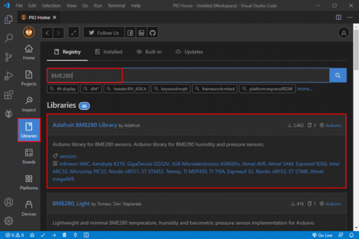

-- Nhấp vào thư viện muốn đưa vào dự án của mình. Sau đó, nhấp vào Add to Project.  

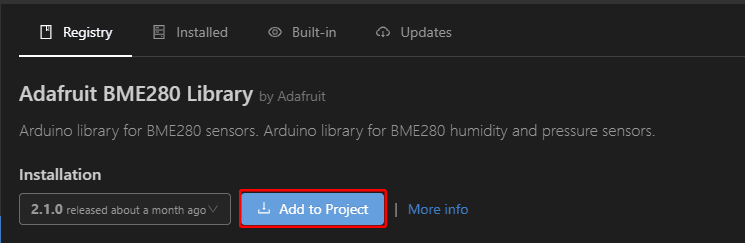


-- Chọn dự án muốn sử dụng thư viện.


-- Thao tác này sẽ thêm code định danh thư viện bằng cách sử dụng lid_depschỉ thị trên file platformio.ini . Nếu mở file platformio.ini của dự án , nó sẽ trông như trong hình ảnh sau.  

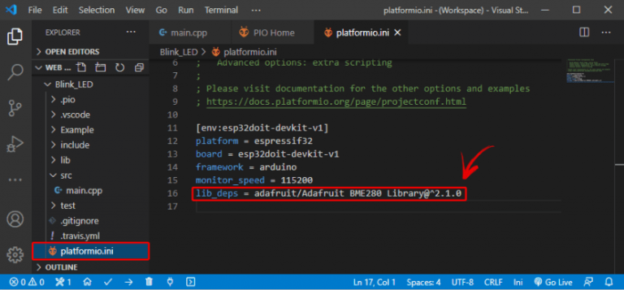

-- Ngoài ra, trên cửa sổ thư viện, nếu chọn tab Installation và cuộn một chút, bạn sẽ thấy code định danh cho thư viện. Có thể chọn bất kỳ số nhận dạng nào tùy thuộc vào tùy chọn muốn sử dụng. Các mã nhận dạng thư viện được đánh dấu màu đỏ.


## Build và Upload code cho ESP32 bằng Platform IO
-- Đây là 1 example huyền thoại là Blink Led trên Arduino IDE, copy đoạn code đó, sau đó paste vào VS code.


Nhớ giữ lại **#include <Arduino.h>** nhé!


-- Sau đó nhấn Build để biên dịch chương trình, Khi terminal báo Success là ok. Nếu chương trình có lỗi, hãy chuyển tab Problems để view lỗi nhé!  
-- Cắm mạch vào và nhấn Upload, nếu đến đoạn connecting mà vscode ko tìm thấy esp, nhấn nút BOOT trên mạch giữ 1 chút rồi nhả ra nhé. Để ESP vào chế độ Nạp.

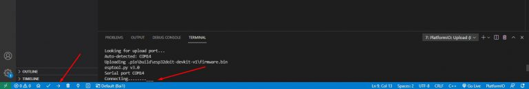

-- Sau khi nạp xong, thì xem thành quả thôi!!!
## 2. Hercules Terminal
**Ứng dụng trong dự án:** UART để hiển thị các dữ liệu truyền nhận được giữa End Devices và Gateway, hỗ trợ mô phỏng để kiểm tra dữ liệu.  
[Link hướng dẫn chi tiết](https://khuenguyencreator.com/huong-dan-hercules-terminal/)  
-- Hercules Terminal cũng như các phần mềm Terminal khác dùng để đọc chuỗi nhận được thông qua các cổng khác nhau trên máy tính.  
-- Bài viết này chỉ đề cập tới việc sử dụng cổng COM hay Serial để đọc và truyền dữ liệu  
-- Đầu tiên các bạn **Download** tại link:  [Hercules Terminal](https://www.fshare.vn/file/DI61DGWVGBXH?token=1676858630)
**Truyền nhận Serial với Hercules Terminal**
-- Mở Terminal lên chọn Tab Serial – Name = Cổng COM đang sử dụng (ở đây mình đang dùng COM4), Baud set cho phù hợp với ứng dụng. Nhấn Open   

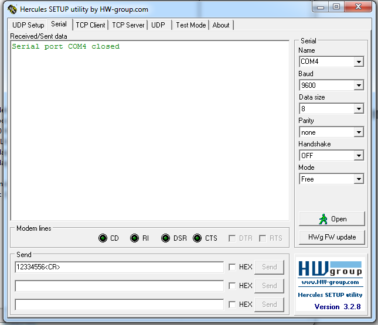  
-- Hướng dẫn Download và sử dụng Hercules Terminal 44  
-- Vậy là có thể truyền nhận dữ liệu thông qua cổng COM rồi nhé.  
## 3. Arduino
**Ứng dụng trong dự án:** UART để hiển thị các dữ liệu truyền nhận được giữa End Devices và Gateway, hỗ trợ mô phỏng để kiểm tra dữ liệu theo thời gian.  
[Link hướng dẫn chi tiết](https://khuenguyencreator.com/bai-1-huong-dan-cai-dat-arduino-ide-va-cach-them-thu-vien/)  
**Bước 1:** Truy cập địa chỉ này để cài đặt [Arduino IDE](https://www.arduino.cc/pro/software-arduino-pro-ide/). Đây là nơi lưu trữ cũng như cập nhật các bản IDE của Arduino. Bấm vào mục **Windows ZIP file**  như hình minh họa.  

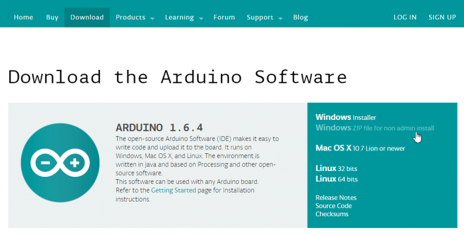  

Web chuyển đến một trang mời quyền góp tiền để phát triển phần mềm cho Arduino, tiếp tục bấm **JUST DOWNLOAD** để bắt đầu tải.

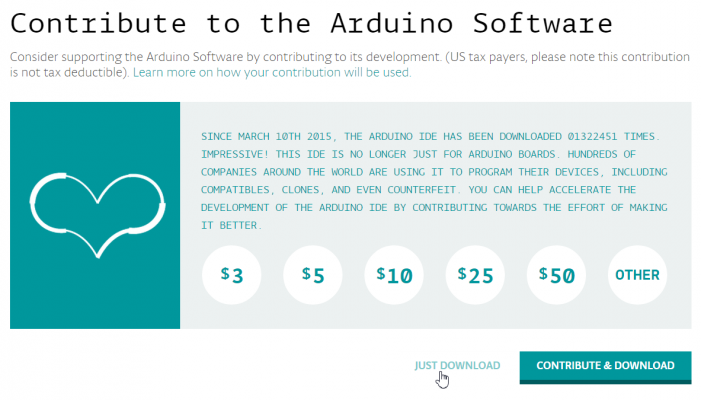

**Bước 2:** Sau khi download xong, bấm chuột phải vào file vừa **download arduino-1.6.4-windows.zip** và chọn **“Extract here”** để giải nén.

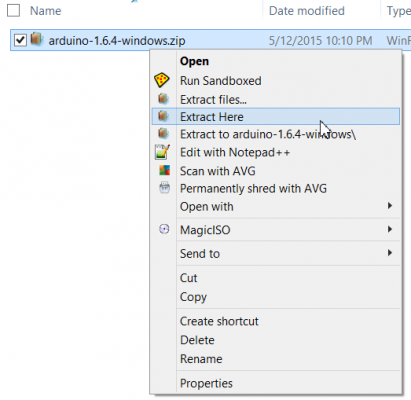

**Bước 3:** Copy thư mục arduino-1.6.4 vừa giải nén đến nơi lưu trữ.
**Bước 4:** Chạy file cài đặt trong thư mục arduino để cài đặt Arduino IDE và khởi động nó lên. 

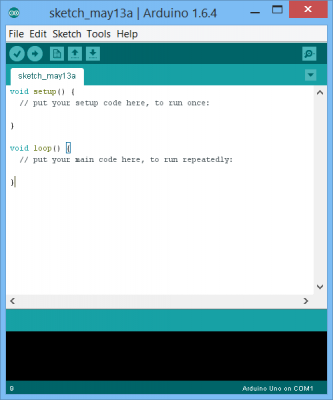

Như vậy là đã cài đặt Arduino IDE xong.  

**Cài đặt Serial**
-- Cài đặt **Port** truyền nhận dữ liệu (ở đây đang dùng COM5) và tốc độ truyền ở **Upload Speed**.

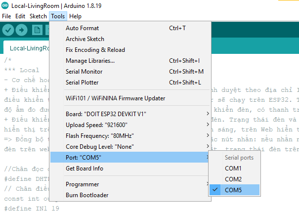

Serial trên Adrunino có chế độ **Show Timestamp** để hiển thị thời gian truyền nhận đến **ms**.

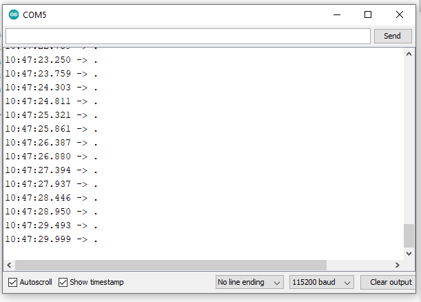  

# II. Triển khai dự án
## 1. Truyền nhận dữ liệu giữa End Devices và Gateway bằng giao thức MQTT  
a) Các hàm khởi tạo
```c
// Khởi tạo kết nối MQTT tới MQTT Server
  client.setServer(mqtt_server, 1883);
// Khởi tạo hàm callbackMQTT để cập nhật dữ liệu mới vào các topic
  client.setCallback(callbackMQTT);
```  
b) Các hàm kiểu tra và duy kết nối Client - Broker
```c
    // Kiểm tra kết nối client-broker
      if (!client.connected()) 
      {
        reconnect_MQTT();
      }
    // Duy trì quá trình kết nối client-broker:
      client.loop();
```  
c) Hàm public dữ liệu vào topic 
```c
  boolean client.publish (topic, payload);
Với:
topic - chủ đề để xuất bản lên.
payload  - thông báo cần xuất bản.
Hàm này trả lại về:
+ True - xuất bản thành công.
+ False - xuất bản không thành công, mất kết nối hoặc tin nhắn quá lớn.
```  
d) Hàm subscribe vào topic
```c
   boolean client.subscribe(topic);
Với: topic - chủ đề để được đăng ký.
Hàm này trả lại:   
+ True - gửi đăng ký thành công.
+ False - gửi đăng ký không thành công, mất kết nối hoặc tin nhắn quá lớn.

```
## 2. Truyền nhận dữ liệu giữa  Gateway và Firebase bằng giao thức HTTP  
a) Các hàm khởi tạo
```c
// Khởi tạo kết nối tới Firebase
  connect_Firebase();
// Khởi tạo hàm callbackMQTT để cập nhật dữ liệu lên Firebase
  client.setCallback(callbackMQTT);
// Khởi tạo hàm streamCallback để cập nhật dữ liệu mới vào các topic ở Gateway 
   if (!Firebase.beginMultiPathStream(DATA_Fb_2_Mos, parentPath))
   Firebase.setMultiPathStreamCallback(DATA_Fb_2_Mos, streamCallback, streamTimeoutCallback);

```  
-- Trong dự án, nhóm em sẽ sử dụng 3 hàm để truyền nhận dữ liệu giữa Gateway và Firebase:  
+ Firebase.setString(FirebaseData, "Path”, messageMQTT): truyền dữ liệu messageMQTT từ Gateway lên Firebase vào biến ở đường dẫn Path.  
+ FirebaseData.get(“Path”): kiểm tra xem có dữ liệu mới ở Firebase hay không.  
+ FirebaseData.value.c_str(): lấy dữ liệu từ Firebase về Gateway.  

Với:  
+ FirebaseData: tên biến dữ liệu Firebase.  
+ Path: đường dẫn đến biến lưu dữ liệu.  
+ messageMQTT: dữ liệu từ Gateway gửi lên Firebase.  

b) Hàm cập nhật dữ liệu từ Firebase về Gateway  
-- Khi database ở Firebase thay đổi thì hàm StreamCallback mới được gọi. Vào Callback sẽ kiểm tra từng hàm DATA_Fb_2_Mos.get(childPath[i]) (với childPath[i] là đường dẫn đến từng biến dữ liệu). Hàm này sẽ trả về True khi dữ liệu thay đổi, False khi dữ liệu không đổi.  
-- Kiểm tra hàm này nếu trả về True thì sẽ lưu dữ liệu nhận được vào biến App_Request và bật cờ lên để thực hiện public dữ liệu App_Request vào từng topic tương ứng.  
```c
//streamCallback()
void streamCallback(MultiPathStreamData DATA_Fb_2_Mos)
{
  size_t numChild = sizeof(childPath) / sizeof(childPath[0]);

  for (size_t i = 0; i < numChild; i++)
  { 
    // DATA_Fb_2_Mos: biến dùng để lưu dữ liệu từ Firebase về Mosquitto
    // DATA_Fb_2_Mos.get : ứng với từng path (đường dẫn đến từng path con: path nhỏ nhất)
    // Kiểm tra xem có path nào cập nhật thì set cờ báo tương ứng với thiết bị được điều khiển 
    if (DATA_Fb_2_Mos.get(childPath[0]))
    {
      App_Request = DATA_Fb_2_Mos.value.c_str();
      flag_light2 = true;
    } 
    ...
  }
}

```  
-- Kiểm tra cờ Flag trong vòng Loop, nếu cờ này bằng True thì tiến hành Public dữ liệu App_Request vào topic tương ứng với từng Path. Ví dụ: Path “childPath[0]” sẽ có cờ flag_light2 ứng với topic “pb/dk/Den2”.  
```c  
if(flag_light2 == true)
    {
      if (App_Request == "1")  client.publish("pb/dk/Den2", "ON");              
      if (App_Request == "0")  client.publish("pb/dk/Den2", "OFF");
      flag_light2 = false;
    }

```  
b) Hàm cập nhật dữ liệu từ Gateway lên Firebase  
-- Khi dữ liệu ở các topic thay đổi thì hàm callbackMQTT mới được gọi. Tên topic sẽ được lưu vào biến topic; dữ liệu sẽ được lưu vào biến messageMQTT, độ dài dữ liệu lưu vào biến length.  
-- Kiểm tra xem là dữ liệu mới của topic nào thì sẽ gửi vào Path tương ứng trên Firebase. Ví dụ: topic “pk/tt/den1” sẽ ứng với Path "/G15_SmartHome/LivingRoom/Status/Light1".  
```c
/ callbackMQTT() - Xử lý gói tin nhận được qua giao thức MQTT xong đẩy lên Firebase
  void callbackMQTT(char* topic, byte* payload, unsigned int length) 
  {
    char messageBuff[100] = {'\0'};
    int i = 0;
    for (i = 0; i < length; i++) 
    {
      messageBuff[i] = (char)payload[i];
    }
    messageBuff[i] = '\0';
    String messageMQTT = String(messageBuff);
    //Serial monitor check
    Serial.print("Message arrived [");
    Serial.print(topic);
    Serial.print("] ");
    Serial.println(messageMQTT);
    String TOPIC = String(topic);
 
    //-------------------------------------------------------------
    // #define topic2 "pk/tt/Den1"
      if(TOPIC == topic2)
      {
        if(messageMQTT == "ON") Firebase.setString(DATA_Mos_2_Fb, "/G15_SmartHome/LivingRoom/Status/Light1", messageMQTT);
        if(messageMQTT == "OFF") Firebase.setString(DATA_Mos_2_Fb, "/G15_SmartHome/LivingRoom/Status/Light1", messageMQTT);  
        return;
      }
      ...
  }

```  

## 3. Truyền nhận dữ liệu giữa  Firebase và Mit App Inventor bằng giao thức HTTP  
Nhóm em sẽ sử dụng App để phục vụ hai chức năng chính của hệ thống:  
-- Chức năng hiển thị trạng thái của Đèn và một số kịch bản như hiển thị nhiệt độ, trạng thái của cảm biến hồng ngoại, …  
+) Để có thể đọc được dữ liệu từ Firebase đến App, nhóm em sử dụng chức năng của một số khối sau để thực hiện:  

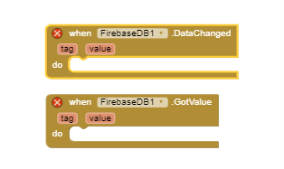   

+) Ở đây khi Database ở Firebase thay đổi khối “When FirebaseDB1. Data Changed” sẽ nhận được và đọc dữ liệu thay đổi đó.
+) Sau đó khối “When FirebaseDB1. GotValue” sẽ đọc và hiển thị lên App dữ liệu vừa nhận được.  
+) Ví dụ như đây là trạng thái của đèn phòng khách được hiển thị trên App:   

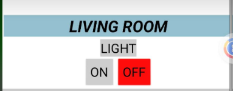  

+) Hoặc đây là nhiệt độ của phòng bếp được hiển thị trên App:  

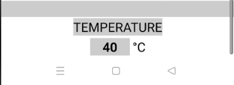  

-- Chức năng điều khiển các thiết bị ví dụ như điều khiển bật/tắt đèn, điều khiển mức quạt và rèm theo kịch bản của hệ thống.  
+) Điều khiển bật/tắt đèn: Nhóm em sẽ điều khiển thông qua các nút nhấn có trên App với chức năng khi nút nhấn được nhấn sẽ gửi dữ liệu xuống Firebase rồi sau đó Firebase sẽ gửi dữ liệu đó xuống các thiết bị chấp hành.   

  

+) Điều khiển quạt/rèm: Ở đây nhóm em sẽ điều khiển thông qua thanh trượt có tên “Slider” trên App. Tương tự như nút nhấn, nếu giá trị thanh trượt thay đổi thì sẽ gửi dữ liệu đó về Firebase và Firebase sẽ gửi xuống các thiết bị chấp hành.   
+) Ví dụ như ở đây nhóm em đang cho Rèm có 3 mức là 0/1/2 tương ứng với 3 kịch bản là OFF/ON1/ON2. Trong đó ON1 là mở 50% và ON2 là mở 100%.   


-- Giao diện hoàn thiện của App:


## 4. Điều khiển Local  
### 4.1 Web Server  
[Link chi tiết hoạt động của Web Server](https://deviot.vn/tutorials/esp32.66047996/esp32-web-server.91264736)  

-- Web Server sử dụng giao thức HTTP. Để dễ hình dung, khi có một client truy cập vào địa chỉ IP của webserver thì browser sẽ gửi cho server một http request (ứng với GET trong code). Ngay khi nhận được request này server sẽ gửi lại một http response (ứng với request->send trong code) có chứa nội dung là file html: index_html của webserver. 
```c
server.on("/", HTTP_GET, [](AsyncWebServerRequest *request){
    request->send_P(200, "text/html", index_html, processor);
  });
```

```c
// Tạo giao diện cho Web Server
const char index_html[] PROGMEM = R"rawliteral(
<!DOCTYPE HTML><html>
<head>
```
Hàm response file index_html cho Web Client: bao gồm nhiệt độ, độ ẩm, tốc độ quạt và trạng thái đèn.  

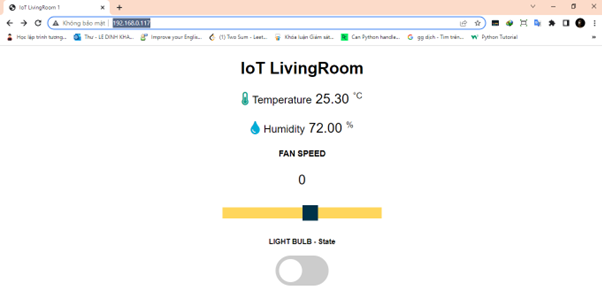

Giao diện từ file html khi truy cập địa chỉ IP của ESP32: 192.168.0.117.


### 4.2 AJAX  
[Link cụ thể về kỹ thuật AJAX](https://wiki.matbao.net/ajax-la-gi-cach-su-dung-ajax-toi-uu-nhat/)  

-- Ajax là cách mà chúng ta xử lý dữ liệu tại một số phần nhỏ trên ứng dụng web mà không cần phải load lại toàn bộ trang web
Cả JavaScript và XML đều hoạt động bất đồng bộ trong AJAX. **Kết quả là, nhiều ứng dụng web có thể sử dụng AJAX để gửi và nhận data từ server mà không phải toàn bộ trang.**

### 4.3 Nút nhấn
-- Xây dựng hàm xử lý khi nhấn nút và chống nhiễu: 
```c
void loop() {
// Nút nhấn cứng và đọc trạng thái nút nhấn
  int reading = digitalRead(buttonPin);
// Hàm xử lý chống dội phím
  if (reading != lastButtonState) {
// bắt đầu đếm 50ms (debounceDelay = 50)
    lastDebounceTime = millis();
  }
/* Khi đủ 50ms thì kiểm tra lại, nếu trạng thái nút nhấn vẫn thay đổi so với trạng 
 thái trước đó (buttonState) thì mới xác định có nhấn phím và đổi trạng thái đèn (ledState) */
  if ((millis() - lastDebounceTime) > debounceDelay) {
    // if the button state has changed:
    if (reading != buttonState) {
      buttonState = reading;
      // only toggle the LED if the new button state is HIGH
      if (buttonState == HIGH) {
        ledState = !ledState;
      }
    }
  }
// Điều khiển nút nhấn
  digitalWrite(output1, ledState);
// Lưu lại giá trị nút nhấn hiện tại
  lastButtonState = reading;
}

```
### 4.4 Một số đoạn code quan trọng  
**a) Đồng bộ trạng thái đèn**
- Hàm gửi yêu cầu GET (http request) cập nhật trạng thái đèn 1s một lần vào URL “/state” từ Web Client
```cpp
<!-- Hàm cập nhật trạng thái đèn sau 1s -->
setInterval(function ( ) {
  var xhttp = new XMLHttpRequest();
  xhttp.onreadystatechange = function() {
    if (this.readyState == 4 && this.status == 200) {
      var inputChecked;
      var outputStateM;
      if( this.responseText == 1){ 
        inputChecked = true;
        outputStateM = "On";
      }
      else { 
        inputChecked = false;
        outputStateM = "Off";
      }
      document.getElementById("output").checked = inputChecked;
      document.getElementById("outputState").innerHTML = outputStateM;
    }
  };
  xhttp.open("GET", "/state", true);
  xhttp.send();
}, 1000 ) ;
</script>

```
- Sau khi nhận được yêu cầu từ Web Client vào URL “/state”, Web Server sẽ đọc trạng thái chân điều khiển đèn qua hàm digitalread() và phản hồi ( http response) cho Web Client bằng hàm request->send. Từ đó hiển thị đồng bộ trạng thái đèn trên Web.
```c
// Đọc trạng thái đèn và hiển thị lên web
// Send a GET request to <ESP_IP>/state
  server.on("/state", HTTP_GET, [] (AsyncWebServerRequest *request) {
    request->send(200, "text/plain", String(digitalRead(output1)).c_str());
  });

```
**b) Điều khiển tốc độ quạt**
- Khi thanh trượt tốc độ quạt thay đổi thì hàm updatesliderPWM sẽ được gọi. Web Client sẽ gửi 1 yêu cầu get vào URL/slider kèm theo giá trị của thanh trượt: sliderValue. 
```c
<!-- Hiển thị thanh trượt điều khiển quạt -->
  <h3>FAN SPEED</h3>
  <p><span id="textSliderValue">%SLIDERVALUE%</span></p>
  <p><input type="range" onchange="updateSliderPWM(this)" id="pwmSlider" min="0" max="9" value="%SLIDERVALUE%" step="1" class="slider2"></p>
<!-- Khi thanh ghi thay đổi thì lấy giá trị và hiển thị lên Web bằng 
cách tạo yêu cầu get -->
  <script>
  function updateSliderPWM(element) {
  var sliderValue = document.getElementById("pwmSlider").value;
  document.getElementById("textSliderValue").innerHTML = sliderValue;
  console.log(sliderValue);
  var xhr = new XMLHttpRequest();
  xhr.open("GET", "/slider?value="+sliderValue, true);
  xhr.send();
}
</script>

```
- Từ yêu cầu của http vào URL: /slider, web server sẽ nhận giá trị hiện tại của thanh trượt lưu vào biến sliderValue. Từ giá trị này em sẽ điều khiển tốc độ quạt thông qua hàm ledwrite(), sau đó phản hồi lại Web Client bằng hàm request -> send.
```c
server.on("/slider", HTTP_GET, [] (AsyncWebServerRequest *request) {
    String inputMessage;
    // GET input1 value on <ESP_IP>/slider?value=<inputMessage>
    if (request->hasParam(PARAM_INPUT)) {
      inputMessage = request->getParam(PARAM_INPUT)->value();
      sliderValue = inputMessage;
	  data = map(sliderValue.toInt(),0,9,0,255);
      ledcWrite(ledChannel,data);
    }
    else {
      inputMessage = "No message sent";
    }
    Serial.println(inputMessage);
    request->send(200, "text/plain", "OK");
  });

```
